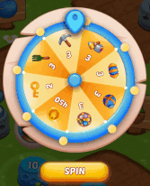
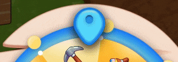
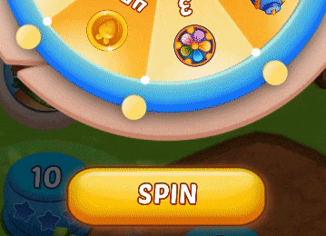
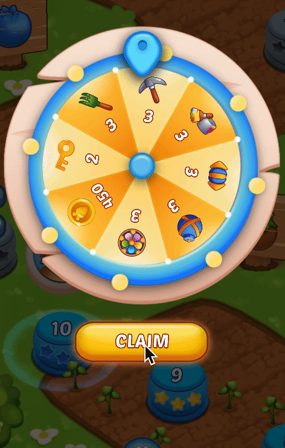
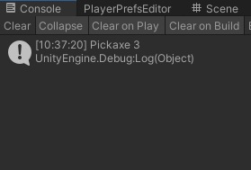

**DEVELOPER CANDIDATE CASE**

*   “SampleScene” is under Assets>Scenes folder
*   Game resolution must be 1080x1920
*   Candidates can edit but __are not allowed to move, delete or replace__ any object or component on the scene
*   The wheel should start it’s turn by the “SPIN” button and should be inactive during the spin

 

*   The pin should slow down and stop the wheel randomly over a reward by colliding with white buttons

*   “SPIN” button text should change to “CLAIM” when the wheel stops

*   By pressing the “CLAIM” button, the reward should scale and move to the middle of the screen then moves to the left bottom corner by scaling down. When the movement finishes, the console should write the amount and the name _(**Clockwise order of the names from the gif below:** pickaxe, paint bucket, rocket, bomb, flowerball, coin, key, rake)_ of the award.

*   Deactivating and reactivating the LuckyWheel gameobject should reset the wheel
